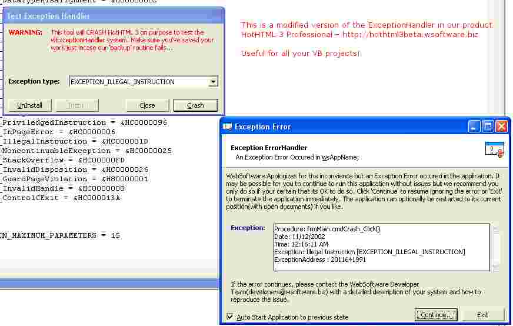

<div align="center">

## wExceptionHandler


</div>

### Description

wExceptionHandler will let your application be near-bullet proof from crashing for unhandled errors because of bad subclassers, windows GPF's and any other unhandled exceptions.

This will get the description of the exception caused, allow you to resume executing/running your application if an unhandled exception is thrown and shows you a dialog with some debug information about the exception whcih you could email to the developer etc.

I decided to post this almost a year ago but didnt get around to doing it but after (http://www.planet-source-code.com/vb/scripts/showcode.asp?txtCodeId=41421&lngWId=1)Will Barden did I decided i'll upload mine too...

I must give credit to Jonathan Lunman who wrote a (http://archive.devx.com/premier/mgznarch/vbpj/1999/05may99/bb0599.pdf)VBPJ Article(Not from MSDN Mag as i thought)a few years back(1999) which is where this code is inspired/backboned by and thank-you to Vlad Vissoultchev for pointing this out:)
 
### More Info
 


<span>             |<span>
---                |---
**Submitted On**   |2002-12-11 00:33:54
**By**             |[Thushan Fernando](https://github.com/Planet-Source-Code/PSCIndex/blob/master/ByAuthor/thushan-fernando.md)
**Level**          |Intermediate
**User Rating**    |5.0 (109 globes from 22 users)
**Compatibility**  |VB 5\.0, VB 6\.0
**Category**       |[Debugging and Error Handling](https://github.com/Planet-Source-Code/PSCIndex/blob/master/ByCategory/debugging-and-error-handling__1-26.md)
**World**          |[Visual Basic](https://github.com/Planet-Source-Code/PSCIndex/blob/master/ByWorld/visual-basic.md)
**Archive File**   |[wException15109912102002\.zip](https://github.com/Planet-Source-Code/thushan-fernando-wexceptionhandler__1-41471/archive/master.zip)

### API Declarations

```
Private Declare Sub CopyMemory Lib "kernel32" Alias "RtlMoveMemory" (pDest As EXCEPTION_RECORD, ByVal LPEXCEPTION_RECORD As Long, ByVal lngBytes As Long)
Private Declare Function SetUnhandledExceptionFilter Lib "kernel32" (ByVal lpTopLevelExceptionFilter As Long) As Long
Private Declare Sub RaiseException Lib "kernel32" (ByVal dwExceptionCode As Long, ByVal dwExceptionFlags As Long, ByVal nNumberOfArguments As Long, lpArguments As Long)
```


